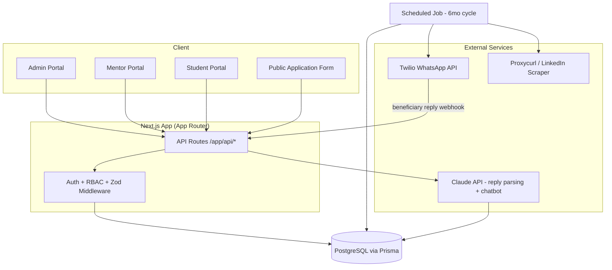
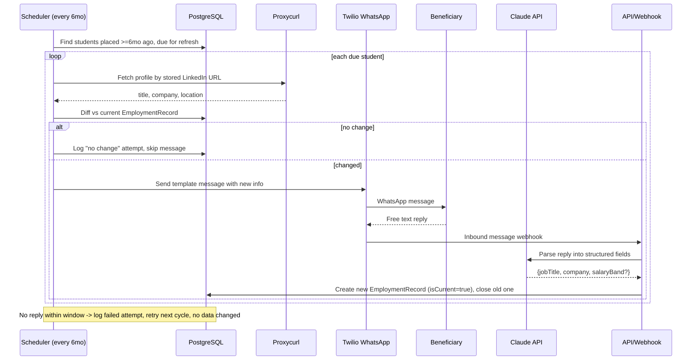
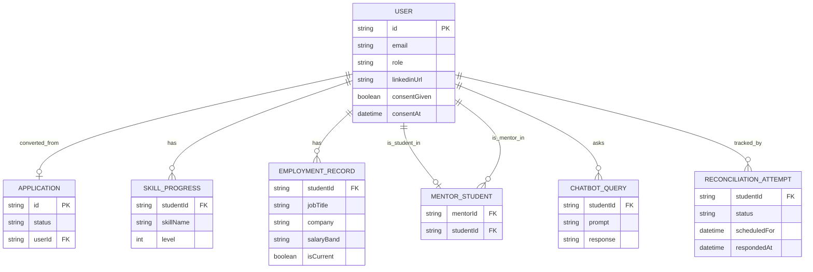
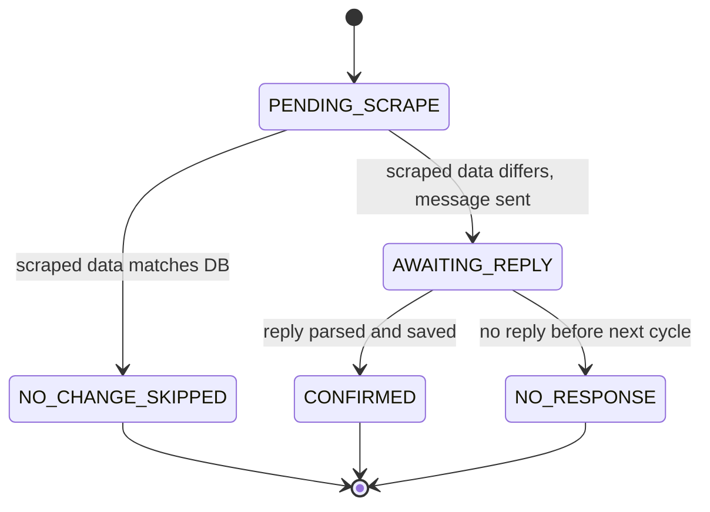

# HLD — EduTrack High-Level Design

Status: Draft v1 · Companion to `prd.md` · Last updated: 2026-08-16

## 1. Tech Stack

| Layer | Choice |
|---|---|
| Framework | Next.js (App Router) — frontend + API routes in one codebase |
| Language | TypeScript |
| Database | PostgreSQL |
| ORM | Prisma |
| Auth | JWT in HTTP-only cookie, custom middleware (no third-party auth provider) |
| Validation | Zod on every API route |
| Messaging | Twilio WhatsApp Business API |
| LinkedIn data | Proxycurl / Bright Data (third-party scraping service) |
| Reply parsing | LLM (Claude API) — free text → structured JSON |
| Styling | Tailwind (per `postcss.config.mjs`) |

## 2. System Architecture



## 3. Post-Placement Reconciliation — Sequence Diagram



## 4. Data Model (ER overview)



`RECONCILIATION_ATTEMPT` is a new table (not in the original schema) that tracks
each 6-month cycle per student: `PENDING_SCRAPE → NO_CHANGE_SKIPPED |
AWAITING_REPLY → CONFIRMED | NO_RESPONSE`. This keeps a clean audit trail
separate from the actual `EmploymentRecord`, so a bad scrape or unanswered
message never silently corrupts confirmed data.

## 5. Module → Folder Mapping (avoids merge conflicts, see `stakeholders.md`)

```
app/
  api/
    auth/            -> auth module
    applications/    -> application pipeline module
    career/          -> career tracking module
    dashboard/        -> dashboard module
    chatbot/         -> chatbot module
    reconciliation/  -> WhatsApp+LinkedIn module (webhook + cron trigger)
lib/
  auth/              -> jwt, cookies, RBAC middleware (shared, frozen after Phase 0)
  validation/        -> zod schemas (shared, frozen after Phase 0)
  scraper/           -> proxycurl client
  whatsapp/          -> twilio client + template senders
  llm/               -> reply-parsing prompt + client
prisma/
  schema.prisma      -> shared, single-owner edits only (see stakeholders.md)
```

## 6. Reconciliation State Machine



## 7. Open Items Before Build (see `prd.md` §8)

- Twilio template approval status/timeline.
- Whether LLM-parsed updates need an admin approval step before committing
  (current default: auto-commit; state machine above supports adding a
  `PENDING_ADMIN_REVIEW` state later without breaking anything).